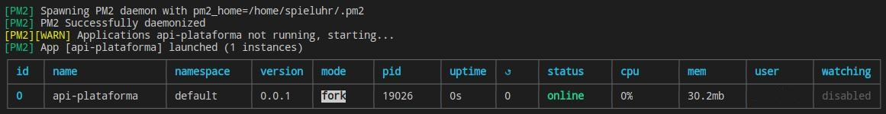

## Description

[Nest](https://github.com/nestjs/nest) framework TypeScript starter repository.

## 1) Copiar carpeta

Descomprimir la carpeta denominda api-plataforma en la ubicación que desee.
Moverse a la raiz de la carpeta:

```bash
# Comando para ubicarse en la raiz de la API-REST
$ cd api-plataforma
```

## 2) Instalación de API nivel pruebas

```bash
# Comando que instala  todas las librerías necesarias para ejecutar la API-REST
$ npm i
```

## 3) Levantar el servicio de la API

```bash
# Comando para ejecutar pm2
$ npx pm2 restart pm2.json
```

Ejecutando este comando se levantará el servicio denominado PM2.
Este servicio permite ejecutar nodejs 



El gráfico que se muestra en la parte superior muestra PM2 ya ejecutado y en espera de comunicación desde la capa del cliente.

